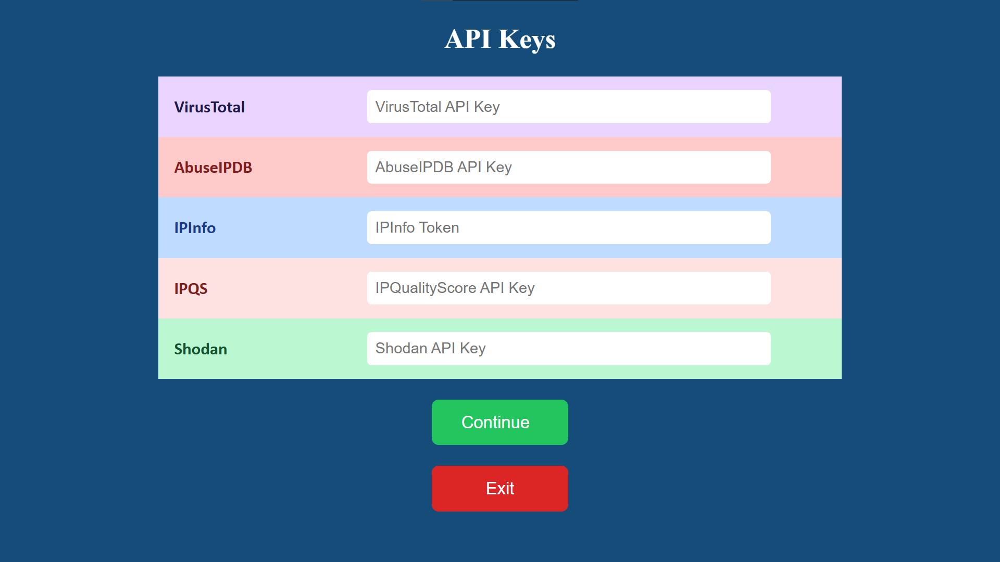
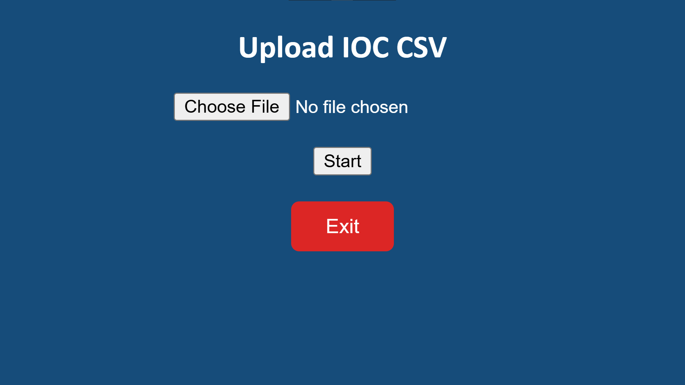
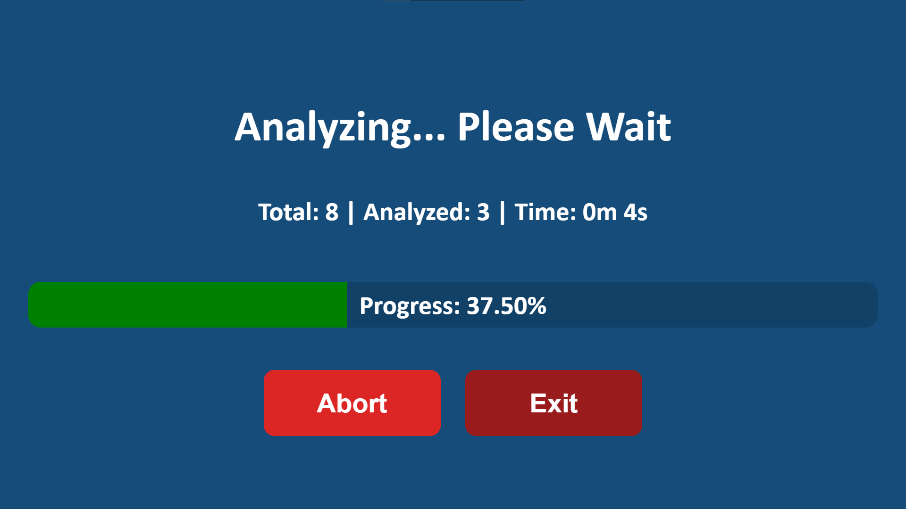
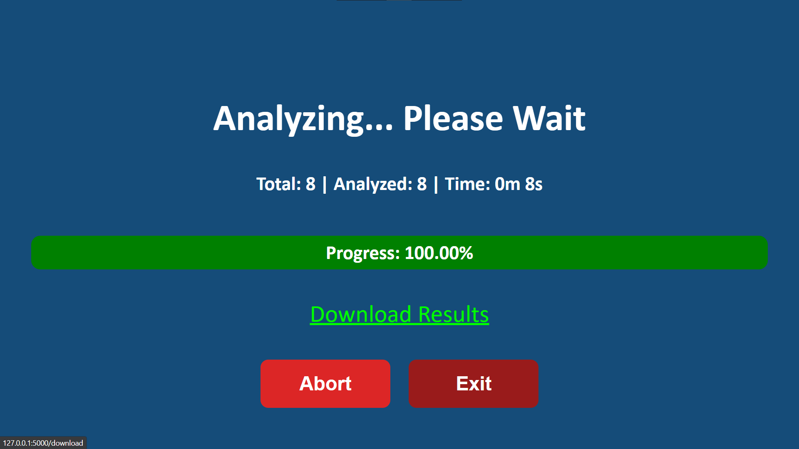
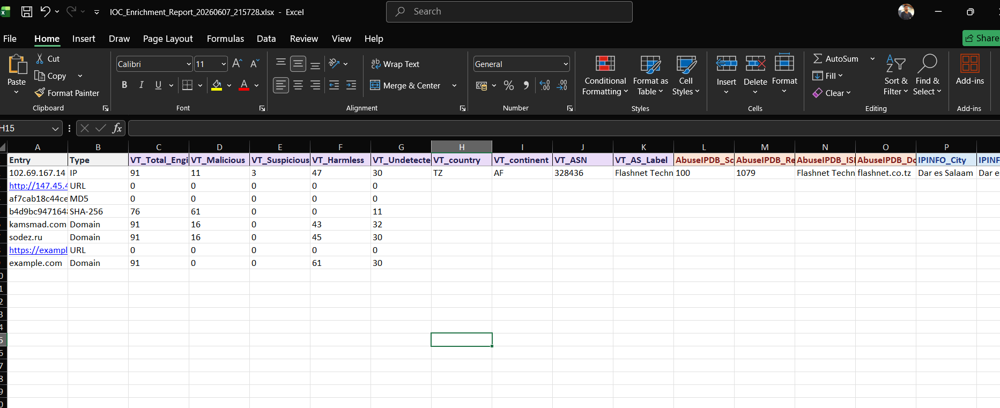
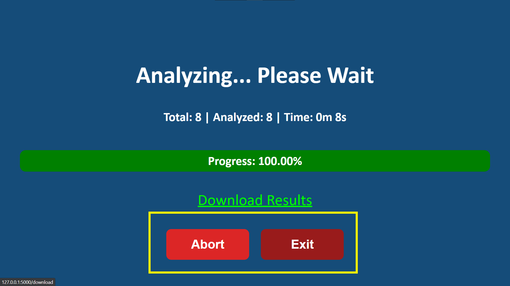

# BulkOSINT

> Bulk IOC Enrichment Platform for Security Operations, Threat Hunting and Incident Response

---

## Overview

BulkOSINT is a lightweight Flask-based IOC enrichment platform that allows analysts to enrich thousands of indicators using multiple OSINT sources simultaneously.

Instead of manually querying VirusTotal, AbuseIPDB, IPInfo, IPQualityScore and Shodan one IOC at a time, BulkOSINT automates the process and generates a consolidated Excel report ready for investigations, threat hunting, or case documentation.

---

## Why BulkOSINT?

SOC analysts frequently receive lists of:

* Suspicious IP addresses
* Domains
* URLs
* Malware hashes

Manually enriching these indicators can take hours.

BulkOSINT allows analysts to:

✅ Upload a CSV

✅ Automatically detect IOC types

✅ Query multiple intelligence sources

✅ Monitor enrichment progress

✅ Download a consolidated report

---

## Supported IOC Types

| Type       | Example                                                          |
| ---------- | ---------------------------------------------------------------- |
| IP Address | 8.8.8.8                                                          |
| Domain     | microsoft.com                                                    |
| URL        | [https://example.com](https://example.com)                       |
| MD5        | 44d88612fea8a8f36de82e1278abb02f                                 |
| SHA1       | 3395856ce81f2b7382dee72602f798b642f14140                         |
| SHA256     | e3b0c44298fc1c149afbf4c8996fb92427ae41e4649b934ca495991b7852b855 |

---

## Data Sources

### VirusTotal

Provides:

* Detection statistics
* Malware reputation
* WHOIS data
* ASN information
* Registrar details
* File intelligence

### AbuseIPDB

Provides:

* Abuse Confidence Score
* Historical reports
* ISP information

### IPInfo

Provides:

* Geolocation
* Organization
* ASN owner
* Timezone

### IPQualityScore

Provides:

* Fraud Score
* VPN detection
* Proxy detection
* TOR detection

### Shodan

Provides:

* Open ports
* Operating system
* Known vulnerabilities

---

# Workflow

```text
CSV Upload
    │
    ▼
IOC Type Detection
    │
    ▼
OSINT Lookup API
    │
    ├── VirusTotal
    ├── AbuseIPDB
    ├── IPInfo
    ├── IPQS
    └── Shodan
    │
    ▼
Data Aggregation
    │
    ▼
Excel Report Generation
    │
    ▼
Download Report
```

---

# Screenshots

## API Key Configuration

Enter API credentials before processing.



Features:

* Color coded providers
* One-click startup
* Safe application exit

---

## IOC Upload Page

Upload a CSV containing indicators.



---

## Real-Time Progress Dashboard

Track enrichment progress live.



Features:

* Total IOC count
* Processed IOC count
* Elapsed time
* Progress percentage
* Abort button

---

## Download link when complete

Features:

* Shows the download link when completed



---

## Generated Excel Report

All results are exported automatically.



---

## Abort or Exit anytime

You can abort or exit the program anytime

* It is important to click "Exit" in order to terminate and kill the program and analysis
* Just closing the browser tab does not terminate the program



---

# Running BulkOSINT

```bash
Launch "BulkOSINT V2.3.exe"
```

The application will:

1. Start a local web server
2. Open your default browser
3. Load the BulkOSINT interface

```text
http://127.0.0.1:5000
```

---

## Input Format

CSV must contain a column named:

```csv
entry
```

Example:

```csv
entry
8.8.8.8
1.1.1.1
google.com
microsoft.com
https://example.com/login
44d88612fea8a8f36de82e1278abb02f
```

---

## IOC Detection

| IOC        | Type   |
| ---------- | ------ |
| 8.8.8.8    | IP     |
| google.com | Domain |

---

## Example Output

| Entry      | Type   | VT_Malicious | AbuseIPDB_Score | Country |
| ---------- | ------ | ------------ | --------------- | ------- |
| 8.8.8.8    | IP     | 0            | 0               | US      |
| google.com | Domain | 0            | N/A             | N/A     |

---

## Generated Report Structure

```text
IOC_Enrichment_Report_20260506_143500.xlsx
```

---

# Output Columns

## VirusTotal

```text
VT_Total_Engines
VT_Malicious
VT_Suspicious
VT_Harmless
VT_Undetected
```

---

## AbuseIPDB

```text
AbuseIPDB_Score
AbuseIPDB_Reports
AbuseIPDB_ISP
AbuseIPDB_Domain
```

---

## IPInfo

```text
IPINFO_City
IPINFO_Region
IPINFO_Country
IPINFO_Org
IPINFO_Timezone
```

---

## IPQualityScore

```text
IPQS_Fraud_Score
IPQS_Proxy
IPQS_VPN
IPQS_Tor
```

---

## Shodan

```text
Shodan_OS
Shodan_Ports
Shodan_Vulns
```

---

# FAQ

### Do I need all API keys?

No, BulkOSINT will continue processing with whichever APIs are configured.

---

### Can I process only domains?

Yes, IOC types are detected automatically.

---

### Is internet access required?

Yes, All enrichment data is retrieved from external intelligence providers.

---

### What happens if I abort processing?

The tool:

* Stops processing
* Deletes temporary files
* Terminates the application safely

---

### Is this suitable for SOC operations?

Yes, The tool was designed specifically for:

* SOC investigations
* Threat hunting
* Malware analysis
* Incident response
* IOC triage

---

# Future Enhancements

* GreyNoise integration
* AlienVault OTX integration
* Censys integration
* IOC deduplication
* Concurrent processing
* PDF reports
* Dark mode UI
* User authentication

---

# Disclaimer

BulkOSINT relies on third-party APIs and their associated rate limits. Processing speed may vary depending on IOC volume, internet connectivity, and API quotas.

---

# Author

Ujjawal Yadav

Bulk IOC Enrichment Platform for Cybersecurity Operations.